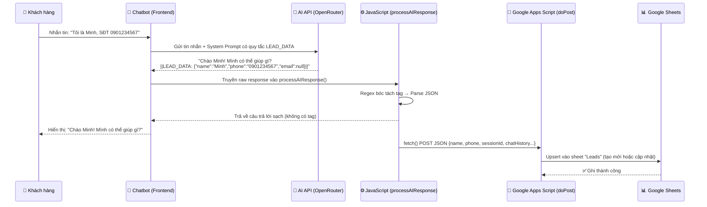

# 🎯 Hệ Thống Thu Thập Lead Tự Động Qua AI Chatbot

## Tổng Quan Luồng Hoạt Động



### Chi Tiết Cấu Hình
- **Base URL**: `https://9router.vuhai.io.vn/v1`
- **Model**: `ces-chatbot-gpt-5.4`
- **Authentication**: `sk-4bd27113b7dc78d1-lh6jld-f4f9c69f`

### Cơ Chế Bóc Tách (Regex)
```javascript
const dataPattern = /\|\|LEAD_DATA:\s*(\{.*?\})\s*\|\|/;
```
Hàm `processAIResponse()` sẽ quét kết quả trả về từ AI, nếu thấy tag `||LEAD_DATA:...||` thì sẽ tách phần JSON ra để gửi về Google Sheets qua Apps Script, sau đó xóa tag này để hiển thị nội dung "sạch" cho người dùng.
